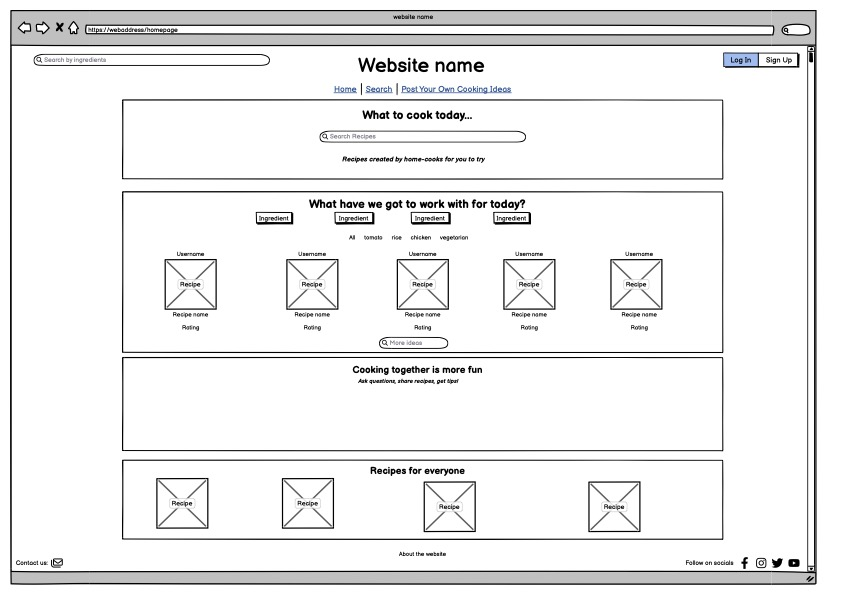
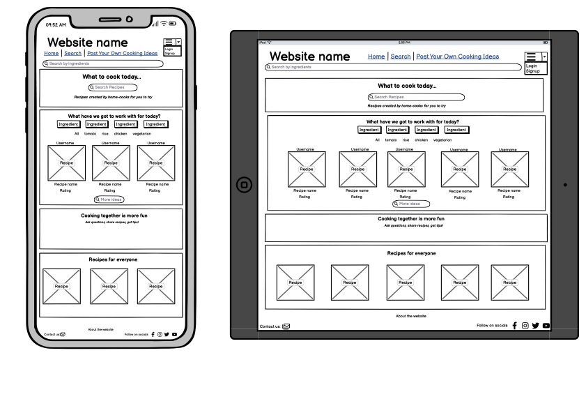

# **Anna's Cookbook Blog**

## **Introduction**

Anna's Cookbook Blog is a blog-type website where I will be posting my own recipes for others to look at and make themselves. It is an updated version of my original [Cookbook](https://annacakes281.github.io/my-cookbook/index.html) Website that I had created before using basic HTML and CSS. Users will also have the option to like and comment on recipe posts.

The blog is aimed at anyone who enjoys cooking and is interested in trying a variety of recipes. The recipes are easy to follow along with and for different levels of cooking experience.

## **Table of Contents**

<a href="#creators-comments">Creators Comments</a>

<ul>
<li>Reasons Behind The Blog</li>
<li>Inspirations</li>
<li>My Thoughts</li>
</ul>

<a href="#page-design">Page Design</a>

<ul>
<li>Wireframes</li>
</ul>

<a href="#agile-development">Agile Development</a>

<ul>
<li>User Stories</li>
<li>MoSCoW Prioritisation</li>
<li>Milestones</li>
</ul>

<a href="#features">Features</a>

<ul>
<li>Django & Bootstrap</li>
<li>Homepage</li>
<li>Nav Bar</li>
<li>Search</li>
<li>My Profile</li>
<li>Accounts</li>
<li>Admin Page</li>
<li>Post New Recipe</li>
<li>Recipe View</li>
<li>Recipes for Everyone</li>
<li>Bookmark Recipe</li>
<li>Recipe Page</li>
<li>Liking & Hearts</li>
<li>Comments, Tips & Recommendations</li>
<li>Contact Page</li>
<li>Optimisation</li>
</ul>

<a href="#django">Django</a>

<ul>
<li>External Libraries</li>
<li>Models</li>
<li>Views</li>
<li>Forms</li>
<li>URLs</li>
<li>Admin</li>
</ul>

<a href="#testing">Testing</a>

<ul>
<li>HTML & CSS Testing</li>
<li>Python Testing</li>
<li>Django Testing</li>
<li>Manual Testing</li>
<li>Built-in Linter</li>
<li>Unfixed Bugs</li>
</ul>

<a href="#deployment">Deployment</a>

<ul>
<li>Beta Testing</li>
<li>Heroku</li>
<li>Django</li>
</ul>

<a href="#credits">Credits</a>

<ul>
<li>Content</li>
<li>Images</li>
</ul>

 

## **Creators Comments**

In this section I will talk about my reasons behind creating the blog, any inspirations that I had used for creating it, as well as my thoughts on using Django as well as the other external libraries.

The reason I have included this section was to add some of my personal thoughts and insight behind my creation.

### **_Reasons Behind The Blog_**

I decided to make a Cookbook Blog as I am always cooking at home and thought getting my recipes out there and just food ideas that I make would be an interesting concept. It seemed like the most appropriate idea at the time and I enjoyed creating it.

Although throughout the process I did change my design idea a few times from a standard website and then decided to create a blog instead as I wanted to be able to only post my own recipes rather than having different users posting theirs.

### **_Inspirations_**

There were a few different websites and blogs that I used for inspirations and for creating my inital ideas for the blog. I mainly used them for some design and layout ideas.

- [Natasha's Kitchen](https://natashaskitchen.com/) was one of the blog websites I used as inspiration for a blog as my idea, as this is a website that I have used several times myself when making food and I really like how it is set out, as well as easy to use.
- [Cookpad](https://cookpad.com/uk/home) was a website I looked at during my design phase for ideas on layout and ideas of how I could design my website. This website was going to be used as an inital design before I decided to create a blog instead, however I did still decide to implement a section from here.
- [Let the Baking Begin](https://letthebakingbegin.com/) was another blog that I looked at when creating my blog idea for how to create my layout and features to include. This is another blog that I have personally used before.
- [CodeStar Blog](https://github.com/Code-Institute-Solutions/Django3blog/tree/master) was the project I did follow from to help create the inital base for my blog, although I did make several changes to the code, design, views, models to suite my blog.

### **_My Thoughts_**

I really enjoyed using Django to create my blog, despite having some issues that I needed to think outside the box to fix. I used several different external libraries with Django to help create several features, such as [Cloundinary](https://cloudinary.com/) to store my images and media files externally, [Bootstrap](https://getbootstrap.com/) as a framework for further CSS design and [ElephantSQL](https://www.elephantsql.com/) as an external SQL database. I will further discuss the external libraries that were used in the <a href="#external-libraries">External Libraries</a> section.

I would definetly use Django again for future projects and I would like to learn more about the different features involved to be able to create more complex projects in the future.

I am very happy with the blog that I have designed and the features that I have included, and I look forward to implementing more in the future.

## **Page Design**

When creating my inital page design I used an application called Balsamiq to create a Wirefreme for my project. I had several ideas that I designed, and my final live design of my Blog differs from the inital wireframe design, due to changing of my idea throughout the course of implementation.

### **_Wireframes_**

Below is the inital wireframe design I had for my project, however when creating my project my ideas had changed and I decided to go for a blog rather than a website. Although I still included some of the features from the inital design that I wanted to.

I created a view for the desktop and for mobile/tablet before deciding to implement more of the features that were avaliable using the Bootstrap framework.

<em>The inital desktop view for the website/blog</em>

<em>The inital mobile/tablet view for the website/blog</em>

The inital design has changed from the finished design of the blog in a few ways:
<strong>FINISH THIS SECTION WHEN ADDED FINAL SECTION OF BLOG IN!!</strong>

- The nav bar is displayed at the top of the page with a brand name, with the different nav links and search bar, as well as motto 'Release your Kitchen Creations'
- There is an about section on the main page at the top rather than in the footer
- Main section of recipe posts that is pagniated rather than the inital idea sections
- I decided to keep the 'Recipes for Everyone' section...(FINISH EXPLAINING WHEN SECTION ADDED!!)

<strong>ADD IMAGE OF WEBSITE</strong>

## **Agile Development**

Throughout the project I used the Agile Development methodology to help aid aspects and features of my project - and have found this very helpful. It has helped me know what features I needed to include, which features were more important than other features to be implemented before others, the user stories as well as milestones to reach for the project.

The main aspects of Agile that I utlised were:

- User Stories
- MoSCoW Proritisation
- Milestones

### **_User Stories_**

The [User Stories](https://github.com/users/annacakes281/projects/3) project board was a helpful tool when creating my project. It helped me understand the reason why the feature needed to be implemented, as well it helped me keep track what needed to be done, what was in progress and what was completed.

There is a board view in the project that shows the 'Todo', 'In Progress' and 'Done' sections, and a table view that shows all the User Stories in a table view.

### **_MoSCoW Prioritisation_**

The [MoSCoW Prioritisation](https://github.com/users/annacakes281/projects/4) board was helpful in breaking down the features for the blog in different types of priorities of importance for the blog.

- The 'Must Have' are features that needed to be included in the blog at this point in time before the final release of the project.
- The 'Should Have' are features that will add a significcnt value to the blog but are not vital to the completion of the project, I decided to only add these features if I manage to get all the 'Must Have' features implemented.
- The 'Could Have' are features that would only have a small impact if left out the blog. I decided to add these features into the blog once both 'Must Have' and 'Should Have' features have been implemented into the blog.
- The 'Won't Have' are features that won't be implemented into the blog at this stage in the iteration, but will be added into the blog after the inital release of the finished project. The reason these features weren't implemented at this time were due to time constraints and issues with the 'Must Have' features and during deployment testing. The features that were not implemented will not have much of an impact on the final design at this stage.

I also decided to add a 'Deployment/Admin' section to keep track of the deployment stages that I wanted to implement after each of the sections were completed. I also wanted to keep track of the admin/documentation that needed to be carried out for the project, such as 'Python Testing' and the 'README'.

This project board has a 'Roadmap' and a 'Table' view as well. The roadmap view has two different date fields, a field that shows the predicted start date for each of the features and the actual start date for them. While the table view shows all the features and necessary information laid out in a table for an easy view.

### **_Milestones_**

Another Agile method I used were [Milestones](https://github.com/annacakes281/annas-cookbook-blog/milestones?state=closed) (this shows all closed milestones for the blog, the only open milestone is the future implementations as these have not been created yet). Using milestones helped to add each of the features into iterations of what features I wanted to have completed and by when, including adding beta deployment.

- <strong>User Stories:</strong> <em> 13 issues total</em> I created this milestone just to store the User Stories, it wasn't a necessary thing to do however I thought it would be another quick and easy way to access all the User Stories from one place. This milestone was completed and closed.
- <strong>Beta Release 1:</strong> <em> 8 issues total, 6 features, 2 deployments.</em> The purpose of this milestone was to get the basis of the blog up and running so that there was some sort of content avaliable to view, as well as the inital test beta deployment to ensure everything works correctly and then the test beta 1 to ensure all the features added were functioning as intended on deployment. This milestone was completed before the intended due date and closed.
- <strong>Beta Release 2:</strong> <em> 9 issues total, 8 features, 1 deployment.</em> This milestone goes further into the 'Must Have' features for the blog, including a second beta test to ensure it is still working upon deployment. This milestone was completed before the intended due date and closed.
- <strong>Beta Release 3:</strong> <em> 3 issues total, 2 features, 1 deployment.</em> This milestone has the final 2 features needed from the 'Must Have' section needed for the project as well as beta test 3 to ensure that the blog is still functioning as intended after adding the final 'Must Have' features. This milestone was completed before the intended due date and closed.
- <strong>Should Have Features:</strong> <em>4 features.</em> This milestone contains all the 'Should Have' features for the blog that will be implemented once the 'Must Have' features from Beta Releases 1-3 were completed. This milestone was completed and closed.
- <strong>Could Have Features:</strong> <em>3 issues total, 2 features, 1 deployment.</em> This milestone contains all the 'Could Have' features for the blog that will be implemented once the 'Must Have' features from Beta Releases 1-3 and 'Should Have' features were completed. This milestone also has a final beta 4 deployment to ensure that all the new features are working as intended on deployment. This milestone was completed and closed.
- <strong>Future Implementations:</strong> <em>3 features.</em> This milestone contains features that will be implemented in a future iteration of the project. These featuresnot being added do not have an affect on how the current blog functions. This milestone has not been completed and is still currently open.
- <strong>Alpha Release:</strong> <em>3 issues total, 2 admin, 1 deployment.</em> This milestone contains the final deployment of the project, once testing has been completed, as well as some final administation for the project. This milestone was completed and closed.

## **Features**

In this section I will discuss the different features that I had implemented into my blog. Including the frameworks and libraries that I used to help create the blog.

### **_Django & Bootstrap_**

To help create the basis for my project I used a Python framework known as [Django](https://www.djangoproject.com/). This framework created the necessary admin-based side with the settings for the blog, as well as the blog application itself.

Another framework which I used alongside Django in creating the layout for my project was [Bootstrap](https://getbootstrap.com/) and this was for taking my CSS design further and ensuring it was more optimised.

I also used several other libraries within my project, and these are discussed in further detail in the <a href="#external-libraries">External Libraries</a> section.

### **_Homepage_**

The homepage is the mainpage where a user lands on when going to the blog. There are different areas and sections that a user can interact with.

- The navigation bar where the logo sits, several navigation links that change depending whether a user is 'autenticated' or a 'superuser', my profile page, a search bar, and a motto. This becomes collapsable when viewed on smaller screens.
- About section that has a small paragraph about the blog, as well as a 'add new recipe' button that is only visible if the user is a 'superuser'.
- The recipe view where the user can see all the posts of the recipes. A photo, the author, the title, date posted, number of likes and number of hearts can be seen. This view is also paginated.
- THE RECIPE FOR EVERYONE SECTION WRITE ABOUT ONCE IMPLEMENTED
- The footer where there is a link to a contact page, as well as a small section to socials.

### **_Nav Bar_**

The purpose of the nav bar is for users to be able to navigate to different pages throughout the website and be able to go back to the home page. The search feature is also itegrated into the nav bar. The nav bar will be displayed across each of the pages on the site. When viewed on smaller screens/viewports the navbar will collapse to provide optimisation.

- The logo 'Anna's Cookbook' and 'Home' will bring users back to the homepage.
- The 'Admin Page' is only visible if the user is a 'superuser' and will take the user to the admin panel where they can do admin tasks (this is further explained in the <a href="#admin">Admin</a> section).
- When a user is not logged in they can see 'Register' and 'Login' in the navbar, which will take the user to the different accounts side, and when a user is logged in they can see the 'Logout' option (further details about <a href="#accounts">Accounts</a> can be viewed here).
- There is a 'Search' bar in the navbar as well that users can learch for recipes or ingredients that they want to see (this is further discussed in the <a href="#search">Search</a> section).

 <em>The navbar when logged out/not signed in/registered</em>
 <em>The navbar when an admin/superuser</em>
 <em>The navbar when a regular user</em>

### **_Search_**

The search bar allows users to search for recipes by 'name' or 'ingredient'. The user can either press enter to search or click on the button and this will take users to a 'search results' page displaying all the results. If a user doesn't type anything and just searches it will display all the posts avaliable. The search bar makes it easier if a user is looking for a specific recipe or ingredient to use.

 <em>Search bar</em>
 <em>Search bar results 1</em>
 <em>Search bar results 2</em>

### **_My Profile_**

The 'My Profile' page can only be accessed if a user is logged into the blog. This page will display any recipes that a user has bookmarked. This makes it easy for users to find what recipes are their favourites.

 <em>My Profile</em>

### **_Accounts_**

There are three different account pages that a user can see on the blog. If they are not signed in they have the option to 'login' or 'register' or if they are logged in they can 'logout'.

- The register page will allows users to sign up for the blog by creating a 'username', 'email' (which is optional), and a 'password' and then they can sign up. There is also a link that small section that asks whether the user already has an account, and then they can 'sign in' instead. Once they have registered it will redirect the user to the homepage.
- The sign in page will allow already registered users to sign in with their username and password, also having the 'remember me' option. At this current moment in time there is no 'forgot password' feature implemented. Once a user has logged in, they will be redirected back to the homepage.
- The logout page will take users to a page where they can 'signout' of the blog. Once they have signed out, the page will be redirected back to the homepage.

 <em>Register Page</em>
 <em>Sign in Page</em>
 <em>Logout Page</em>

### **_Admin_**

The admin page is a view that is provided by Django. I have decided to implement a quick way to access this page in the nav bar so that 'superusers' also known as 'admins' can easily gain access to the admin side. As an admin there are several different things that can be viewed and done from this page, making it an important page to be able to access and view.

- Admins are able to see any recent actions that were made.
- Admins are able to see 'email address' associated with accounts, as well as add and make any changes.
- Admins are able to see 'Users' and 'Groups. The 'User' page will show the admins all of the current website users, as well as whether they are an admin or not. They also have the ability to view and edit user details. It is important to note that password data is not stored.
- Admins are able to see the Django Summernote 'Attachments' which are any of the images used on the recipe posts
- Admins are able to see and manage the comments, tips, and posts on the blog at ease. From the Post page, admins are able to add new blog posts easily. Within the comments and tips pages, admins are able to remove comments if needed. There is also an easy search feature across these pages to easily find what the admin may be looking for.
- Admins are able to view and edit 'Sites'.
- Admins are able to view and edit 'social accounts' associated with the blog.

 <em>Main Admin View</em>
 <em>Post View</em>
 <em>Users View</em>

### **_Post New Recipe_**

The 'Add New Recipe' is at the bottom of the about section and is only displayed of the user is an 'admin/superuser'. When clicked it will take the user directly to the 'Post New Recipe' page on the admin pannel. I included this as a quick and easy way to be able to add new recipes to the blog.

 <em>With Admin Logged on</em>
 <em>Without Admin Logged on</em>

### **_Recipe View_**

On the homepage page all the recipes that are posted are displayed with the newest displaying first. The view is pagniated and once there is more than (3 or 6 EDIT THIS ONCE COMPLETED HOME PAGE) it will condense and a button will appear to go to the 'Next' or 'Prev' page.

- Users can see the post itself with the finished photo of the recipe that the post is crating, with the author name displayed in the photo. If no photo is provided when adding the post, then a placeholder photo will be displayed instead.
- The name of the recipe is displyed and this is what users will click on to go to the recipe post.
- The date the recipe was posted on is displayed so that users can see when the recipe was posted on, as well as making it easy to order the recipes.
- The total 'like' and 'heart' count is also displayed so that users can see the popularity of a recipe.

 <em>Recipe Homepage View</em>

### **_Recipes For Everyone_**

- photo of homepage and when clicked on recipe
- purpose and what it does
- TO CREATE THIS SECTION!!!

### **_Bookmark Recipe_**

The 'Bookmark Recipe' button allows users to easily add recipes they like to their profile so that they can go back to it at anytime, without the need to search for the recipe constantly. By clicking the button it will add the recipe to the profile page, and if it is already added, it will remove the recipe from the profile. This feature is only avaliable and visible to users that are logged into the blog.

 <em>Bookmark Recipe Button</em>

### **_Recipe Page_**

When a user clicks onto a recipe from the homepage, it will take them to a recipe page where they can view the ingredients and steps to create the recipe themselves.

- There is a title box with the 'author', 'posted on' and 'edited on' dates, and a photo of the recipe.
- On the main content of the page there is a 'Bookmark Recipe' button that will allow users who are logged in to save the recipe and add it to their profiles.
- The main content for the recipe has different sections, which is all taken from the model created for the post (further information about the models can be found in the <a href="#models">Models</a> section.):
  - There is an about section, which is essentially ehe excerpt for the recipe, that just contains some information about the recipe and just some thoughts and suggestions.
  - The next 2 small sections are the 'Prep Time' and 'Cook Time' which lets users know how long it will take to prep for the recipe and how long it will take to cook/bake it.
  - Then the next section contains the 'Ingredients' that will be needed to create the recipe. Some recipes also contain 'equipment needed' but this was added into the same section. This section was designed using an external library called Summernote (more on external libraries found <a href="#external-libraries">here</a>).
  - The final section is the 'Steps' which list the instructions on creating the recipe. This section was also created using Summernote.
- At the bottom of the main recipe content there is the 'Likes', 'Hearts', 'Comments' and 'Tips' count, as well as the ability to 'Like' and 'Heart' a post.
- The bottom of the page has the 'Comment' and 'Tips and Recommendations' section where a user can leave a comment and tip/recommendation on the page. A user must be signed in to leave a comment and tip/recommendation, but they can view them being logged out. These sections were also created using models.
  - As an 'admin/superuser' there is a button that appears that will take them directly to the manage sections for the 'comment' and 'tips' so that they can directly manage them.

 <em>Recipe View</em>

### **_Liking & Hearts_**

The 'liking' and 'hearts' feature is something for users to interact with, to be able to react to a recipe. Users must be logged in to be able to react to a post. Once a user has liked or hearted (they can do both if they want) it will add a number count, which is displayed on the recipe page, as well as on the homepage. To unlike and unheart users just need to click the buttons again. This features makes the recipe posts more interactive for the users.

 <em>When Liked/Hearted</em>
 <em>When Logged out</em>

### **_Comments, Tips & Recommendations_**

Users have the ability to leave a 'comment' as well as a 'recommendation and tip' if they are logged in, and this will be displayed at the bottom of the recipe. This allows for user input as well as user suggestions. Any comments and tips/recommendations will be displayed with the most recent at the top, so it seems like a conversation is happening.

Admins have the ability to see a 'Manage' button for each section so that they can remove any comments they they deem necessary.

 <em>Comment Area</em>
 <em>Tips & Recommendations Area</em>

### **_Contact Page_**

The purpose of the contact page is so that users are able to send recipe suggestions to the owner. They will need to fill out a form, which users JavaScript to send to form back to the users email. Once the form has been submitted a popup box appears letting users know whether the request has been successful or not. The email then appears in my spare email box so that I can see what recipe ideas that users may have. The contact form uses an external feature called [Email JS](https://www.emailjs.com/), which will be discussed further in the <a href="#external-libraries">External Libraries</a> section.

 <em>Contact Page</em>
 <em>When Submitted</em>

### **_Optimisations_**

To help with optimisations foe the blog, I used the Bootstrap framework classes for styling CSS - as well as adding my own media queries in. Using Bootstrap classes have allowed for near complete optimisation when viewing on different screensizes/viewports which has been very helpful and useful during the creating of this project, as well as for the general design of the layout. By adding some media queries in, I also was able to change some of the CSS that I needed to function and optimise correctly for better responsiveness.

- The nav bar becomes collapsed when it reaches certain dimensions to allow for a cleaner look.
- The entire homepage also becomes more condensed the smaller the viewport is and then becomes more responsive for a better optimised view for users on smaller screens.
- Each of the pages will also follow suite and become more responsive depending on the screensize

 <em>Nav Bar Collapse</em>
 <em>Homepage Optimised</em>
 <em>Recipe Page Optimised</em>

## **Django**

- intro into using django to create the application in more detail

### **_External Libraries_**

- further detail into the external libraries used in project and reason behind using them (poss add links?)

### **_Models_**

- talk about each of the models implemented and reasons behind it
- add photos of how it looks on the admin view?

### **_Views_**

- talk about each of the views implemented and reasons behind it
- add photos of how it looks?

### **_Forms_**

- talk about each of the forms implemented and reasons behind it
- add photos of how it looks?

### **_URLs_**

- talk about each of the url pattern files implemented and reasons behind it
- add photos of how it looks?

### **_Admin_**

- talk about the admin view files and reasons behind it
- add photos of how it looks?

## **Testing**

- into into the testing section and eachof the tests carried out for the project

### **_HTML & CSS Testing_**

- the html and css testing tool to check code is correct (add photos)

### **_Python Testing_**

- PEP8 python tester (add photos)

### **_Django Testing_**

- using the testing unicode to test the models, views, forms, javascript (still need to finish and do)

### **_Manual Testing_**

- manual testing of clicking and checking everything works myself without errors (only issue so far is contact form on mobile not sending emails)

### **_Built-in Linter_**

- errors from the built-in linter that show up that are related to code, and whether they are necessary

### **_Unfixed Bugs_**

- any unfixed bugs and why they werent addressed

## **Deployment**

- intro into deployment for the project

### **_Beta Testing_**

- done some beta testing throughout milestones to check content working the way it is needed

### **_Heroku_**

- steps taken to deploy to heroku
- add photos

### **_Django_**

- what steps in django needed to deploy (settings, env, requirements)

## **Credits**

- intro into section

### **_Content_**

- external content sources used to help with project
- codestar (include videos/source code)
- <https://forum.djangoproject.com/t/creating-a-button-for-the-admin-page/15147>
  <https://stackoverflow.com/questions/11916297/django-detect-admin-login-in-view-or-template>
  <https://stackoverflow.com/questions/35557129/css-not-loading-wrong-mime-type-django>
  <https://devmaesters.com/blog/34>
  <https://learndjango.com/tutorials/django-search-tutorial>
  https://stackoverflow.com/questions/59811002/display-search-bar-and-search-button-inline-with-css
  <https://www.youtube.com/watch?v=H4QPHLmsZMU>
  (format these properly)
- mentor suggestions for whitenoise and summernote pages

### **_Images_**

- adobe stock photos for placeholder image (update the placeholder image)
