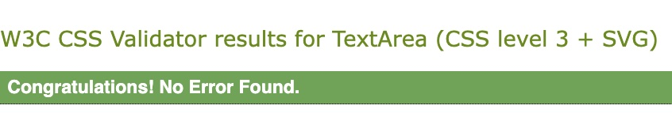

# **Anna's Cookbook Blog**

## **Introduction**

Anna's Cookbook Blog is a blog-type website where I will be posting my own recipes for others to look at and make themselves. It is an updated version of my original [Cookbook](https://annacakes281.github.io/my-cookbook/index.html) Website that I had created before using basic HTML and CSS. Users will also have the option to like and comment on recipe posts.

The blog is aimed at anyone who enjoys cooking and is interested in trying a variety of recipes. The recipes are easy to follow along with and for different levels of cooking experience.

## **Table of Contents**

<a href="#creators-comments">Creators Comments</a>

<ul>
<li>Reasons Behind The Blog</li>
<li>Inspirations</li>
<li>My Thoughts</li>
</ul>

<a href="#page-design">Page Design</a>

<ul>
<li>Wireframes</li>
</ul>

<a href="#agile-development">Agile Development</a>

<ul>
<li>User Stories</li>
<li>MoSCoW Prioritisation</li>
<li>Milestones</li>
</ul>

<a href="#features">Features</a>

<ul>
<li>Django & Bootstrap</li>
<li>Homepage</li>
<li>Nav Bar</li>
<li>Search</li>
<li>My Profile</li>
<li>Accounts</li>
<li>Admin Page</li>
<li>Post New Recipe</li>
<li>Recipe View</li>
<li>Recipes for Everyone</li>
<li>Bookmark Recipe</li>
<li>Recipe Page</li>
<li>Liking & Hearts</li>
<li>Comments, Tips & Recommendations</li>
<li>Contact Page</li>
<li>Optimisation</li>
</ul>

<a href="#django">Django</a>

<ul>
<li>External Libraries</li>
<li>Models</li>
<li>Views</li>
<li>Forms</li>
<li>URLs</li>
<li>Settings</li>
<li>Admin</li>
</ul>

<a href="#testing">Testing</a>

<ul>
<li>HTML & CSS Testing</li>
<li>Python Testing</li>
<li>Django Testing</li>
<li>Manual Testing</li>
<li>Built-in Linter</li>
<li>Unfixed Bugs</li>
</ul>

<a href="#deployment">Deployment</a>

<ul>
<li>Beta Testing</li>
<li>Django Deployment</li>
<li>Heroku</li>
</ul>

<a href="#credits">Credits</a>

<ul>
<li>Content</li>
<li>Images</li>
</ul>

 

## **Creators Comments**

In this section I will talk about my reasons behind creating the blog, any inspirations that I had used for creating it, as well as my thoughts on using Django as well as the other external libraries.

The reason I have included this section was to add some of my personal thoughts and insight behind my creation.

### **_Reasons Behind The Blog_**

I decided to make a Cookbook Blog as I am always cooking at home and thought getting my recipes out there and just food ideas that I make would be an interesting concept. It seemed like the most appropriate idea at the time and I enjoyed creating it.

Although throughout the process I did change my design idea a few times from a standard website and then decided to create a blog instead as I wanted to be able to only post my own recipes rather than having different users posting theirs.

### **_Inspirations_**

There were a few different websites and blogs that I used for inspirations and for creating my inital ideas for the blog. I mainly used them for some design and layout ideas.

- [Natasha's Kitchen](https://natashaskitchen.com/) was one of the blog websites I used as inspiration for a blog as my idea, as this is a website that I have used several times myself when making food and I really like how it is set out, as well as easy to use.
- [Cookpad](https://cookpad.com/uk/home) was a website I looked at during my design phase for ideas on layout and ideas of how I could design my website. This website was going to be used as an inital design before I decided to create a blog instead, however I did still decide to implement a section from here.
- [Let the Baking Begin](https://letthebakingbegin.com/) was another blog that I looked at when creating my blog idea for how to create my layout and features to include. This is another blog that I have personally used before.
- [CodeStar Blog](https://github.com/Code-Institute-Solutions/Django3blog/tree/master) was the project I did follow from to help create the inital base for my blog, although I did make several changes to the code, design, views, models to suite my blog.

### **_My Thoughts_**

I really enjoyed using Django to create my blog, despite having some issues that I needed to think outside the box to fix. I used several different external libraries with Django to help create several features, such as [Cloundinary](https://cloudinary.com/) to store my images and media files externally, [Bootstrap](https://getbootstrap.com/) as a framework for further CSS design and [ElephantSQL](https://www.elephantsql.com/) as an external SQL database. I will further discuss the external libraries that were used in the <a href="#external-libraries">External Libraries</a> section.

I would definetly use Django again for future projects and I would like to learn more about the different features involved to be able to create more complex projects in the future.

I am very happy with the blog that I have designed and the features that I have included, and I look forward to implementing more in the future.

## **Page Design**

When creating my inital page design I used an application called Balsamiq to create a Wirefreme for my project. I had several ideas that I designed, and my final live design of my Blog differs from the inital wireframe design, due to changing of my idea throughout the course of implementation.

### **_Wireframes_**

Below is the inital wireframe design I had for my project, however when creating my project my ideas had changed and I decided to go for a blog rather than a website. Although I still included some of the features from the inital design that I wanted to.

I created a view for the desktop and for mobile/tablet before deciding to implement more of the features that were avaliable using the Bootstrap framework.

<em>The inital desktop view for the website/blog</em>

<em>The inital mobile/tablet view for the website/blog</em>

The inital design has changed from the finished design of the blog in a few ways:
<strong>FINISH THIS SECTION WHEN ADDED FINAL SECTION OF BLOG IN!!</strong>

- The nav bar is displayed at the top of the page with a brand name, with the different nav links and search bar, as well as motto 'Release your Kitchen Creations'
- There is an about section on the main page at the top rather than in the footer
- Main section of recipe posts that is pagniated rather than the inital idea sections
- I decided to keep the 'Recipes for Everyone' section...(FINISH EXPLAINING WHEN SECTION ADDED!!)

<strong>ADD IMAGE OF WEBSITE</strong>

## **Agile Development**

Throughout the project I used the Agile Development methodology to help aid aspects and features of my project - and have found this very helpful. It has helped me know what features I needed to include, which features were more important than other features to be implemented before others, the user stories as well as milestones to reach for the project.

The main aspects of Agile that I utlised were:

- User Stories
- MoSCoW Proritisation
- Milestones

### **_User Stories_**

The [User Stories](https://github.com/users/annacakes281/projects/3) project board was a helpful tool when creating my project. It helped me understand the reason why the feature needed to be implemented, as well it helped me keep track what needed to be done, what was in progress and what was completed.

There is a board view in the project that shows the 'Todo', 'In Progress' and 'Done' sections, and a table view that shows all the User Stories in a table view.

### **_MoSCoW Prioritisation_**

The [MoSCoW Prioritisation](https://github.com/users/annacakes281/projects/4) board was helpful in breaking down the features for the blog in different types of priorities of importance for the blog.

- The 'Must Have' are features that needed to be included in the blog at this point in time before the final release of the project.
- The 'Should Have' are features that will add a significcnt value to the blog but are not vital to the completion of the project, I decided to only add these features if I manage to get all the 'Must Have' features implemented.
- The 'Could Have' are features that would only have a small impact if left out the blog. I decided to add these features into the blog once both 'Must Have' and 'Should Have' features have been implemented into the blog.
- The 'Won't Have' are features that won't be implemented into the blog at this stage in the iteration, but will be added into the blog after the inital release of the finished project. The reason these features weren't implemented at this time were due to time constraints and issues with the 'Must Have' features and during deployment testing. The features that were not implemented will not have much of an impact on the final design at this stage.

I also decided to add a 'Deployment/Admin' section to keep track of the deployment stages that I wanted to implement after each of the sections were completed. I also wanted to keep track of the admin/documentation that needed to be carried out for the project, such as 'Python Testing' and the 'README'.

This project board has a 'Roadmap' and a 'Table' view as well. The roadmap view has two different date fields, a field that shows the predicted start date for each of the features and the actual start date for them. While the table view shows all the features and necessary information laid out in a table for an easy view.

### **_Milestones_**

Another Agile method I used were [Milestones](https://github.com/annacakes281/annas-cookbook-blog/milestones?state=closed) (this shows all closed milestones for the blog, the only open milestone is the future implementations as these have not been created yet). Using milestones helped to add each of the features into iterations of what features I wanted to have completed and by when, including adding beta deployment.

- <strong>User Stories:</strong> <em> 13 issues total</em> I created this milestone just to store the User Stories, it wasn't a necessary thing to do however I thought it would be another quick and easy way to access all the User Stories from one place. This milestone was completed and closed.
- <strong>Beta Release 1:</strong> <em> 8 issues total, 6 features, 2 deployments.</em> The purpose of this milestone was to get the basis of the blog up and running so that there was some sort of content avaliable to view, as well as the inital test beta deployment to ensure everything works correctly and then the test beta 1 to ensure all the features added were functioning as intended on deployment. This milestone was completed before the intended due date and closed.
- <strong>Beta Release 2:</strong> <em> 9 issues total, 8 features, 1 deployment.</em> This milestone goes further into the 'Must Have' features for the blog, including a second beta test to ensure it is still working upon deployment. This milestone was completed before the intended due date and closed.
- <strong>Beta Release 3:</strong> <em> 3 issues total, 2 features, 1 deployment.</em> This milestone has the final 2 features needed from the 'Must Have' section needed for the project as well as beta test 3 to ensure that the blog is still functioning as intended after adding the final 'Must Have' features. This milestone was completed before the intended due date and closed.
- <strong>Should Have Features:</strong> <em>4 features.</em> This milestone contains all the 'Should Have' features for the blog that will be implemented once the 'Must Have' features from Beta Releases 1-3 were completed. This milestone was completed and closed.
- <strong>Could Have Features:</strong> <em>3 issues total, 2 features, 1 deployment.</em> This milestone contains all the 'Could Have' features for the blog that will be implemented once the 'Must Have' features from Beta Releases 1-3 and 'Should Have' features were completed. This milestone also has a final beta 4 deployment to ensure that all the new features are working as intended on deployment. This milestone was completed and closed.
- <strong>Future Implementations:</strong> <em>3 features.</em> This milestone contains features that will be implemented in a future iteration of the project. These featuresnot being added do not have an affect on how the current blog functions. This milestone has not been completed and is still currently open.
- <strong>Alpha Release:</strong> <em>3 issues total, 2 admin, 1 deployment.</em> This milestone contains the final deployment of the project, once testing has been completed, as well as some final administation for the project. This milestone was completed and closed.

## **Features**

In this section I will discuss the different features that I had implemented into my blog. Including the frameworks and libraries that I used to help create the blog.

### **_Django & Bootstrap_**

To help create the basis for my project I used a Python framework known as [Django](https://www.djangoproject.com/). This framework created the necessary admin-based side with the settings for the blog, as well as the blog application itself.

Another framework which I used alongside Django in creating the layout for my project was [Bootstrap](https://getbootstrap.com/) and this was for taking my CSS design further and ensuring it was more optimised.

I also used several other libraries within my project, and these are discussed in further detail in the <a href="#external-libraries">External Libraries</a> section.

### **_Homepage_**

The homepage is the mainpage where a user lands on when going to the blog. There are different areas and sections that a user can interact with.

- The navigation bar where the logo sits, several navigation links that change depending whether a user is 'autenticated' or a 'superuser', my profile page, a search bar, and a motto. This becomes collapsable when viewed on smaller screens.
- About section that has a small paragraph about the blog, as well as a 'add new recipe' button that is only visible if the user is a 'superuser'.
- The recipe view where the user can see all the posts of the recipes. A photo, the author, the title, date posted, number of likes and number of hearts can be seen. This view is also paginated.
- THE RECIPE FOR EVERYONE SECTION WRITE ABOUT ONCE IMPLEMENTED
- The footer where there is a link to a contact page, as well as a small section to socials.

### **_Nav Bar_**

The purpose of the nav bar is for users to be able to navigate to different pages throughout the website and be able to go back to the home page. The search feature is also itegrated into the nav bar. The nav bar will be displayed across each of the pages on the site. When viewed on smaller screens/viewports the navbar will collapse to provide optimisation.

- The logo 'Anna's Cookbook' and 'Home' will bring users back to the homepage.
- The 'Admin Page' is only visible if the user is a 'superuser' and will take the user to the admin panel where they can do admin tasks (this is further explained in the <a href="#admin">Admin</a> section).
- When a user is not logged in they can see 'Register' and 'Login' in the navbar, which will take the user to the different accounts side, and when a user is logged in they can see the 'Logout' option (further details about <a href="#accounts">Accounts</a> can be viewed here).
- There is a 'Search' bar in the navbar as well that users can learch for recipes or ingredients that they want to see (this is further discussed in the <a href="#search">Search</a> section).

 <em>The navbar when logged out/not signed in/registered</em>
 <em>The navbar when an admin/superuser</em>
 <em>The navbar when a regular user</em>

### **_Search_**

The search bar allows users to search for recipes by 'name' or 'ingredient'. The user can either press enter to search or click on the button and this will take users to a 'search results' page displaying all the results. If a user doesn't type anything and just searches it will display all the posts avaliable. The search bar makes it easier if a user is looking for a specific recipe or ingredient to use.

 <em>Search bar</em>
 <em>Search bar results 1</em>
 <em>Search bar results 2</em>

### **_My Profile_**

The 'My Profile' page can only be accessed if a user is logged into the blog. This page will display any recipes that a user has bookmarked. This makes it easy for users to find what recipes are their favourites.

 <em>My Profile</em>

### **_Accounts_**

There are three different account pages that a user can see on the blog. If they are not signed in they have the option to 'login' or 'register' or if they are logged in they can 'logout'.

- The register page will allows users to sign up for the blog by creating a 'username', 'email' (which is optional), and a 'password' and then they can sign up. There is also a link that small section that asks whether the user already has an account, and then they can 'sign in' instead. Once they have registered it will redirect the user to the homepage.
- The sign in page will allow already registered users to sign in with their username and password, also having the 'remember me' option. At this current moment in time there is no 'forgot password' feature implemented. Once a user has logged in, they will be redirected back to the homepage.
- The logout page will take users to a page where they can 'signout' of the blog. Once they have signed out, the page will be redirected back to the homepage.

 <em>Register Page</em>
 <em>Sign in Page</em>
 <em>Logout Page</em>

### **_Admin_**

The admin page is a view that is provided by Django. I have decided to implement a quick way to access this page in the nav bar so that 'superusers' also known as 'admins' can easily gain access to the admin side. As an admin there are several different things that can be viewed and done from this page, making it an important page to be able to access and view.

- Admins are able to see any recent actions that were made.
- Admins are able to see 'email address' associated with accounts, as well as add and make any changes.
- Admins are able to see 'Users' and 'Groups. The 'User' page will show the admins all of the current website users, as well as whether they are an admin or not. They also have the ability to view and edit user details. It is important to note that password data is not stored.
- Admins are able to see the Django Summernote 'Attachments' which are any of the images used on the recipe posts
- Admins are able to see and manage the comments, tips, and posts on the blog at ease. From the Post page, admins are able to add new blog posts easily. Within the comments and tips pages, admins are able to remove comments if needed. There is also an easy search feature across these pages to easily find what the admin may be looking for.
- Admins are able to view and edit 'Sites'.
- Admins are able to view and edit 'social accounts' associated with the blog.

 <em>Main Admin View</em>
 <em>Post View</em>
 <em>Users View</em>

### **_Post New Recipe_**

The 'Add New Recipe' is at the bottom of the about section and is only displayed of the user is an 'admin/superuser'. When clicked it will take the user directly to the 'Post New Recipe' page on the admin pannel. I included this as a quick and easy way to be able to add new recipes to the blog.

 <em>With Admin Logged on</em>
 <em>Without Admin Logged on</em>

### **_Recipe View_**

On the homepage page all the recipes that are posted are displayed with the newest displaying first. The view is pagniated and once there is more than (3 or 6 EDIT THIS ONCE COMPLETED HOME PAGE) it will condense and a button will appear to go to the 'Next' or 'Prev' page.

- Users can see the post itself with the finished photo of the recipe that the post is crating, with the author name displayed in the photo. If no photo is provided when adding the post, then a placeholder photo will be displayed instead.
- The name of the recipe is displyed and this is what users will click on to go to the recipe post.
- The date the recipe was posted on is displayed so that users can see when the recipe was posted on, as well as making it easy to order the recipes.
- The total 'like' and 'heart' count is also displayed so that users can see the popularity of a recipe.

 <em>Recipe Homepage View</em>

### **_Recipes For Everyone_**

- photo of homepage and when clicked on recipe
- purpose and what it does
- TO CREATE THIS SECTION!!!

### **_Bookmark Recipe_**

The 'Bookmark Recipe' button allows users to easily add recipes they like to their profile so that they can go back to it at anytime, without the need to search for the recipe constantly. By clicking the button it will add the recipe to the profile page, and if it is already added, it will remove the recipe from the profile. This feature is only avaliable and visible to users that are logged into the blog.

 <em>Bookmark Recipe Button</em>

### **_Recipe Page_**

When a user clicks onto a recipe from the homepage, it will take them to a recipe page where they can view the ingredients and steps to create the recipe themselves.

- There is a title box with the 'author', 'posted on' and 'edited on' dates, and a photo of the recipe.
- On the main content of the page there is a 'Bookmark Recipe' button that will allow users who are logged in to save the recipe and add it to their profiles.
- The main content for the recipe has different sections, which is all taken from the model created for the post (further information about the models can be found in the <a href="#models">Models</a> section.):
  - There is an about section, which is essentially the excerpt for the recipe, that just contains some information about the recipe and just some thoughts and suggestions. This section was designed using an external library called Summernote (more on external libraries found <a href="#external-libraries">here</a>).
  - The next 2 small sections are the 'Prep Time' and 'Cook Time' which lets users know how long it will take to prep for the recipe and how long it will take to cook/bake it.
  - Then the next section contains the 'Ingredients' that will be needed to create the recipe. Some recipes also contain 'equipment needed' but this was added into the same section. This section was designed using Summernote.
  - The final section is the 'Steps' which list the instructions on creating the recipe. This section was also created using Summernote.
- At the bottom of the main recipe content there is the 'Likes', 'Hearts', 'Comments' and 'Tips' count, as well as the ability to 'Like' and 'Heart' a post.
- The bottom of the page has the 'Comment' and 'Tips and Recommendations' section where a user can leave a comment and tip/recommendation on the page. A user must be signed in to leave a comment and tip/recommendation, but they can view them being logged out. These sections were also created using models.
  - As an 'admin/superuser' there is a button that appears that will take them directly to the manage sections for the 'comment' and 'tips' so that they can directly manage them.

 <em>Recipe View</em>

### **_Liking & Hearts_**

The 'liking' and 'hearts' feature is something for users to interact with, to be able to react to a recipe. Users must be logged in to be able to react to a post. Once a user has liked or hearted (they can do both if they want) it will add a number count, which is displayed on the recipe page, as well as on the homepage. To unlike and unheart users just need to click the buttons again. This features makes the recipe posts more interactive for the users.

 <em>When Liked/Hearted</em>
 <em>When Logged out</em>

### **_Comments, Tips & Recommendations_**

Users have the ability to leave a 'comment' as well as a 'recommendation and tip' if they are logged in, and this will be displayed at the bottom of the recipe. This allows for user input as well as user suggestions. Any comments and tips/recommendations will be displayed with the oldest at the top.

Admins have the ability to see a 'Manage' button for each section so that they can remove any comments they they deem necessary.

 <em>Comment Area</em>
 <em>Tips & Recommendations Area</em>

### **_Contact Page_**

The purpose of the contact page is so that users are able to send recipe suggestions to the owner. They will need to fill out a form, which users JavaScript to send to form back to the users email. Once the form has been submitted a popup box appears letting users know whether the request has been successful or not. The email then appears in my spare email box so that I can see what recipe ideas that users may have. The contact form uses an external feature called [Email JS](https://www.emailjs.com/), which will be discussed further in the <a href="#external-libraries">External Libraries</a> section.

 <em>Contact Page</em>
 <em>When Submitted</em>

### **_Optimisations_**

To help with optimisations foe the blog, I used the Bootstrap framework classes for styling CSS - as well as adding my own media queries in. Using Bootstrap classes have allowed for near complete optimisation when viewing on different screensizes/viewports which has been very helpful and useful during the creating of this project, as well as for the general design of the layout. By adding some media queries in, I also was able to change some of the CSS that I needed to function and optimise correctly for better responsiveness.

- The nav bar becomes collapsed when it reaches certain dimensions to allow for a cleaner look.
- The entire homepage also becomes more condensed the smaller the viewport is and then becomes more responsive for a better optimised view for users on smaller screens.
- Each of the pages will also follow suite and become more responsive depending on the screensize

 <em>Nav Bar Collapse</em>
 <em>Homepage Optimised</em>
 <em>Recipe Page Optimised</em>

## **Django**

[Django](https://www.djangoproject.com/) is the framework I used to create my blog application. It is a Python-based framework which makes it easier to create web-based applications. There were several elements required in order to get my blog to function in the required way. I had to ensure that I used the CLI to install Django before starting my blog.

### **_External Libraries_**

There were several external libraries and frameworks I installed and used in the creation of my blog, alongside django. For some of these I needed to ensure I was using the CLI to install the libraries. Several of these external libraries needed to be added to the 'Requirements' file as well as added to the 'Settings', both which are further discussed the the <a href="#deployment">Deployment</a> section.

- [Gunicorn](https://gunicorn.org/) as the web application to help host my blog when in deployment. For this to work I needed to use the CLI to install it at the beginning, after Django. This is also needed in the 'Requirements' and the 'Procfile'.
- [Dj-database](https://pypi.org/project/dj-database-url/) to be able to use an 'environment variable' to configure my blog application. This also needed to be installed using the CLI. This needed to be modified in the 'Settings' file. This library was also added to the 'Requirements'
- [Psycopg2](https://pypi.org/project/psycopg2/) which is the PostgresSQL database adapter needed for my project. This needed to be installed using the CLI. This library is needed in the 'Requirements'.
- [ElephantSQL](https://www.elephantsql.com/) to store my database data, this needed to be added into the 'Env', 'Settings', and 'Config Vars'.
- [Cloudinary](https://cloudinary.com/) to be able to store any media and static files for my blog, this needed to be updated in the 'Settings', as well as installed using the CLI, then added to the 'Requirements'.
- [Summernote](https://summernote.org/) was another library I used in the 'Models' for WYSIWYG when adding the 'Ingredients' and 'Steps' for recipe. This library needed to be installed using the CLI and added to 'Requirements' and 'Settings'.
- [Cripsyforms](https://django-crispy-forms.readthedocs.io/en/latest/) was another library I needed to install using the CLI, then adding to the 'Settings' and 'Requirements'. I used this for the commenting and tips/recommedation sections of the blog.
- [Allauth](https://docs.allauth.org/en/latest/) was another library I used for the account registration, although I haven't implemented all the features included in this as of yet. I had to install this using the CLI and then add it to the 'Requirements' and 'Settings'. After this I needed to run a specific code to get the templates for the accounts installed onto my project.
- [Whitenoise](https://whitenoise.readthedocs.io/en/latest/#quickstart-for-other-wsgi-apps) was another library I used for my project as initally I was having trouble with the CSS showing up on beta deployment, so installing this and adding to 'Requirements' and 'Settings' fixed that issue.
- [EmailJS](https://www.emailjs.com/) was an external website I used to source and store emails for the site, so that users are able to send emails via the contact form. I had to create a template on the EmailJS website and ensure it was all linked up correctly in the javascript and the contact page.

### **_Models_**

The models is the main base I used for creating the blog posts, comments and tips sections for the blog. Without implementing the models, the blog would not be functioning the way it should be. After afding or updating each model, I needed to ensure that I was migrating the data.

The Post Model:

- This is the main model for the blog, where I add the recipes to the website.
- There is a 'Status' const which allows th user to choose whether the post is still a draft (0) or posted (1) and ready to be published.
- There are several fields in model that collerate to different areas and have different field types with different requirements.
- When in the Admin View to post a new recipe all these fields are visible.
- The 'recipe_name' field is for the name of the recipe which will be displayed on the Homepage and when viewing that particular recipe. The name of the recipe must be unique.
- The 'slug' uses the name of the name of the recipe, this will create the URL for the recipe, and therefore must also be unique.
- The 'written_by' field allows the user to choose who the author of the recipe is, most of the time it will be the admin posting the recipe. This has a cascade feature where the posts created by the user will be deleted if the user is deleted.
- The 'recipe_image' field is a cloudinary field and allows users to upload a photo of the recipe. If this is left blank a placeholder image will be put in its place.
- The 'edited_on' field shows the time and date the post was edited/updated on.
- The 'excerpt' field is a text field that allows users to add an excerpt about the post. This field uses Summernote as a design feature. When viewing the post this section shows as the 'About'.
- The 'prep_time' and 'cook_time' sections allow the poster to list how long it will take to prep and cook the recipe.
- The 'ingredients' and 'recipe_steps' fields both use Summernote when adding text to them. These sections allow the poster to list the necessary ingredients and the steps required for the recipe.
- The 'posted_on' field shows the date the post was initally created, and differs from the 'edited_on' field, as the 'posted_on' field will not update if the recipe is edited.
- The 'status' field allows users to choose the status of the post, the default will be draft, and the poster wil need to select posted for the post to appear on the site.
- The 'likes' and 'hearts' are ManyToMany fields which allows one user to like more than one post. This is the feature for users to like and heart on posts.
- The 'bookmarks' is also ManyToMany field which allows one user to bookmark several posts. This feature allows users to save posts to their profile.
- The 'Meta' class is used to sort the ordering out for the posts on what order they are to be displayed on. I have set it so that the newest posts are displayed first.
- The 'str' function is to ensure that the name of the recipe is returned.
- The final two functions is to ensure both the number of 'likes' and 'hearts' are displayed as a count.

 <em>Post Model</em>
 <em>Post Model in Admin View</em>

The (RecipeForEveryone) Model:

- TO DO THIS

 <em>RecipeForEveryone Model</em>
 <em>RecipeForEveryone Model in Admin View</em>

The Comment and Tip Model:

- This is the main models for the comment posts andtip posts for the blog.
- It links to the Post and (RecipesForEveryone) model as a foreignkey and also has a cascade feature that is deleted if the Recipe is deleted.
- The 'name' displays the users name on the comment and tips itself, as well as in the admin view for the comment and tips.
- The 'email' will display only in the admin view if the user has an email added to their account.
- The 'comment' and 'tip' field will be displayed on the recipe post in the comment and tip field, as well as in the admin view.
- The 'posted_on' field will display the time and date when the comment and tip was made, showing on both the comment and tip section, and the admin view. This will display the comment and tips in order with the oldest displayed first.
- Both models use the 'Meta' class of ordering to order the posts by the 'posted_on' order.
- Both models also use the 'str' function so ensure they are returning the correct data when posted.

 <em>Comment Model</em>
 <em>Comment Model in Admin View</em>

 <em>Tip Model</em>
 <em>Tip Model in Admin View</em>

### **_Views_**

There are several views included in my blog, and the views are what are used to get aspects of my blog rendered and displayed on the page. I have used a mix of class-based and function-based views for the blog for different features.

PostList View:

- This is the main view that renders the homepage using the Post model. I used a class-based view to create this.
- It uses the Post model as the main model while using a query set to only grab the recipes that have the published status as well as ordering the recipes by '-posted_on' show it displays with the newest first.
- It then uses the 'index.html' template to render to the view to that page.
- It finally paginates the page by (CHOOSE THE NUMBER) to display that many posts.
- The content required is then added to the HTML file to ensure it is displaying correctly.

 <em>PostList View</em>

ViewRecipe View:

- This is the main view for viewing the recipes when clicking on the post itself. There are several asects to this view in order to get it to function correctly. I also used a class-based view for the ViewRecipe view.
- The first section was the 'get' function which allows users to click on the post and for the page to render and load with the recipe post itself, showing all the necessary features. There is a lot of data here that needed to be added in order for the view to display all the sections required.
- This then renders the view from the 'get' function and shows the recipe post itself.
- The next part of this view was the 'post' function, which allowed users to leave comments and tips on the post. The 'post' function follows the same format as the 'get' function but there are two extra sections added which pulls details through from the forms.
- The 'comment_form' allows users to be able to post a comment and the 'tip_form' allows users to post a tip.
- The 'return render' follows the same method as the 'get' function to render the view of the page again once a comment or a tip has been left.

 <em>ViewRecipe View</em>

PostLike and PostHeart Views:

- Both of these views are the the 'liking' and 'hearting' feature. They were also created using class-based views.
- These ware pretty simple and both follow the same code inside, apart from the naming changing depending on whether it is a like or heart.
- If the user exists and they have already liked/hearted a post, clicking again will remove it, but if it doesn't it will add a heart or like.
- The page will then reload.

 <em>PostLike & PostHeart View</em>

Contact_page View:

- This is a function-based view that will render the contact form page when a user clicks the 'contact page' button

My_profile View: (POSS EDIT)

- This is a function-based view thay will render the profile page when a user clicks the nav bar link that will take users to 'My Profile'

Add_bookmark View: (POSS EDIT)

- This is a function-based view that allows users to add a recipe to their bookmarks. It works in a similar way to the 'PostLike' and 'PostHeart' views...

Add_recipe View:

- This is a function-based view that allows admins to go directly to the 'Add' new recipe page from the admin panel as a quick and easy way to access it.

Manage_comments and manage_tips View:

- These are both function-based views that allow admins to oo directly to the 'Manage' sections for either the comments or the tips in the admin panel.

SearchRecipe View:

- This is class-based view that allows users to search for a recipe using the search bar.
- It uses the Post model and then when an item has been searched it will render a page displaying the results.
- This view uses a queryset function in order to formulate the search correctly, and users can search for posts by the 'recipe name' or 'ingredients'.

 <em>SearchRecipe View</em>

### **_Forms_**

There are two forms that have been implemented into the blog, these are the 'Comment' and 'Tip' forms which are used to leave comments and tips on the recipe posts. When using these forms on the HTML pagesm I had to ensure I was using the tags from the external library I installed for forms, known as CrispyForms.

- The 'CommentForm' uses the Comment model and only uses the 'comment' field so that users can write a comment on the recipe post.
- The 'TipForm' uses the Tip model and only uses the 'tip' field so that users can write a tip on the recipe post.

 <em>Forms</em>

### **_URLs_**

There are two different URL pattern pages for the blog, the one that is in the main blog directory, and the file that is also in the same directory as the settings. I used both to create URL patterns for my blog to make it functional.

URLs in the cookbook directory:

- This is where the URL for the admin page was added and installed so that the admin/superuser can access the admin view, and so that I was able to create a direct link to the admin page.
- I installed the Summernote url here as well, as this was required in order to use Summernote and have it displayed in my blog.
- I also had to include the URL path to ensure that all the URL patterns from the 'recipe_site' were also included.
- I finally also had to include a URL pattern for the accounts side including the 'allauth' library that I installed.
- At the bottom of the URL patterns I also included a piece of code from Summernote so that it will display when deployed.

 <em>Cookbook URL Patterns</em>

URLs in the recipe_site directory: (ADD THE NEW VIEW)

- These URL patterns are made using the views that were created for the blog. There is a mix of class-based and function-based view URL patterns, depending on how the view was set up.
- The first URL is the main URL which displays the homepage.
- The 'view_recipe' URL will take the user to the recipe page that they clicked on, and the main way this is viewed is by using the 'slug' to render the URL name, so that each page is unique.
- Both the 'post_like' and 'post_heart' allows the users to like and heart a post and will then refresh the page with the post having these likes/hearts displaying.
- The 'add_bookmark' URL allows users to be able to add a bookmark and this bookmark will then appear in their profile, dispite the page reloading back to the recipe.
- The 'contact' URL will take users to the contact page.
- The 'search_recipes' URL will take users to the search results page after they have performed a search using the search bar.
- The 'add_recipe', 'manage_comments' and 'manage_tips' URLs will take the admin to the link that they clicked on with ease on the admin panel, rather than having to go through the main admin panel each time.

 <em>Recipe_site URL Patterns</em>

### **_Settings_**

The 'Settings' are what were need for the 'cookbook' blog project. This file contains all the various settings requried for the blog to run. Throughout the project there were several settings that I had updated and changed to ensure the blog would run smoothly in development as well as when deployed.

- One of the changes I made was importing some extra modules into the settings, including the 'dj_database' external library that I used, as well as the 'env' file with secure data needed.
- I had to add a 'templates_dir' const so that the settings knows to look inside the templates directory for the HTML pages.
- I had to ensure that the 'secret_key' was hidden for final production, therefore I created this variable in the 'env' file as well as set it in the 'config vars' on Heroku so that regular users are not able to view this.
- In order for Summernote to run in deployment, I had to add the 'x_frame_options' const into the settings.
- In final production 'debug' has been set to false (EDIT THIS ONCE ONCE ENVIRONMENT SETTINGS BEEN ADDED).
- To allow the blog to display in the browser, I needed to ensure I added the development URL, the localhost as well as the deployment URL into the 'allowed_hosts' const.
- To prevent any errors during login and registration I needed to add the 'account_email_verification' const and set it to 'none' as this is not required.
- There were several extra apps I needed to add into the 'installed_apps' const to ensure the external libraries I had installed using the CLI would function correctly.
- A 'site_id' of 1 also needed to be added into the settings.
- In order for 'allauth' to redirect users back to the homepage after registering/logging in and logging out, I needed to add the homepage as a redirect url as a const var.
- So that 'cripsyforms' functioned correctly I needed to specify a template pack, which was 'bootstrap4' as this is the latest version that cripsyforms is running.
- I needed to add an exra line into the 'middleware' const var for allauth to function correctly, without it, the page would not load.
- In the 'dirs' section of the dictionary I needed to add the 'template_dir' const so that it would link to the templates to display the HTML pages.
- ADD DATABASE SECTION ONCE ENVIRONMENT SECTION DONE FOR DEPLOYMENT
- I had to add the settings in order to get the static and media files to work correctly, and where they can be found in the directory. I also added where the media files would be stored, which is the cloudinary storage platform.

### **_Admin_**

The 'admin' file has some settings that are required for the admin page view. It allows the users navigate easily on each of the models.

PostAdmin:

- This takes the 'summernote model admin' as a parameter, as this will use summernote in three of the fields for the display.
- The 'list_display' shows the admin all the posts on the blog with the headings of 'recipe name', 'slug', 'status' and 'posted on'.
- The admin can search for specific recipes by either the recipe name or the ingredients in the provided search bar.
- The 'prepopulated_fields' allows or whatever the 'recipe name' is to convert into a slug, without the admin having to type this in again. This makes it more easy and convienient.
- The 'list_filter' allows admins to filter posts by either 'status' or 'posted on' dates.
- The 'summernote_fields' shows which fields in the recipe post require the summernote WYSIWYG to appear.

 <em>PostAdmin</em>

CommentAdmin and TipAdmin:

- These admin views both just use their respective models for in order to view the comments and tips.
- Admins are able to see the 'list_display' with the headings of 'name', 'comment/tip', 'post' (for which post the comment or tip was created on) and 'posted on'.
- Admins are able to search for comments and tips by the 'name', 'email' (if known) and the 'commen' or 'tip' content.
- The 'list_filter' allows the admin to filter comments or tips by the 'name' of the user or the 'posted on' date.

 <em>CommentAdmin & TipAdmin</em>

FINAL MODEL: TO DO

 <em>to add</em>

## **Testing**

For the project I done several testing to ensure that it was functioning the way it was intended to. As well as manual testing, I used testing with Django to test the models, views and forms.

### **_HTML & CSS Testing_**

Although it was not necessary to use the validator for HTML, as there was pythonic code in the HTML, I decided to check it anyway to ensure that the standard HTML that I used was correct across the pages. I still thought it was good practise to ensure my HTML was correct. Apart from the errors caused the pythonic code in the HTML code there were no significant errors with the HTML.

Although using the CSS validator was also not necessary, I still decided to use it for good practice purposes. There were no errors found in the CSS for the blog.

<em>CSS validator results</em> 

### **_Python Testing_**

Despite there being a built-in linter (which I also used for checking issues and problems with the code), I also used a [Python Checker](https://www.pythonchecker.com/) to check my python code. This all came back pretty high and correct without any issues and bugs.

### **_Django Testing_**

- using the testing unicode to test the models, views, forms, javascript (still need to finish and do) TO DO THIS TYPE OF TESTING

### **_Manual Testing_**

Throughout the project I performed manual testing on each of the features added during each stage to ensure that it all functions correctly. I once again done some more manual testing in deployment to ensure that it all still works when deployed as well. I also tested on my mobile to see if it all works correctly.

- The only issue I noticed on mobile was when using the contact form, it would say 'message failed to send' popup box from the JavaScript, despite an email still pulling through. This is a bug that should be fixed before the final deploument. CHECK IF THIS IS FIXED BEFORE SUBMISSION

### **_Built-in Linter_**

- errors from the built-in linter that show up that are related to code, and whether they are necessary

Using the built-in linter, the only issues that came up were non-important ones... ADD THIS SECTION WHEN CHECKING THE LINTER

### **_Unfixed Bugs_**

DO THIS SECTION AT THE END BEFORE SUBMISSION

## **Deployment**

This section will discuss all the steps in the deployment process, as well as the beta testing deployment that I carried out throughout the project. I have also discussed the steps I on Django before deploying to Heroku.

### **_Beta Testing_**

Throughout the project, I had beta test milestones, where I planned to deploy the projecto to test how it would function when live. The reason I done this was to ensure that once I added in main features that it would still function correctly upon deployment. I did need to ensure some certain steps were taken in order for deployment to work in <a href="#django-deployment">Django</a> and <a href="#heroku">Heroku</a> (discussed in those sections).

### **_Django Deployment_**

There were a few steps needed to be done in Django areas itself before deployment. This included updating the settings, requirements and creating a env and Procfile.

Settings:

- TO ADD BEFORE DEPLOYMENT

Env:

- This file is added to the .gitignore as it contains sensitive information.
- I have the 'database_url' stored in here that has the link to the elephantsql database that I have been using, and so that it remains hidden.
- My secret key is also stored in here, so that it remains hidden.
- My 'cloudinary_url' is also stored in here to ensure it remains hidden, as well as has the url to my cloudinary server.

Requirements:

- After installing external libraries to Django, I had to add them to my requirements in order for them to work on deployment.
- This was easily done in the CLI using the line: 'pip3 freeze --local > requirements.txt'.

Procfile:

- The Procfile tells Heroku what type of application the blog is and what library to run. In the case of the blog, it will be running 'gunicorn' as a 'web' application using 'wsgi'.

### **_Heroku_**

- steps taken to deploy to heroku, config vars
- add photos
- DO THIS FOR FINAL DEPLOYMENT

## **Credits**

This section will contain all the sources I would like to credit that I used in order to help create my blog project.

### **_Content_**

<https://www.youtube.com/watch?v=H4QPHLmsZMU>
(format these properly)

- mentor suggestions for whitenoise and summernote pages

- The Code Instite Codestar blog tutorial. I mainly used this to help create the basis for my blog and then expand my idea

  - Source code for [CodeStar](https://github.com/Code-Institute-Solutions/Django3blog/tree/master) blog.

- To help create the nav bar link to gain access to the admin view, I looked at the follow forum for [Creating a Button for Django Admin](https://forum.djangoproject.com/t/creating-a-button-for-the-admin-page/15147).

- I used the following page to check whether a user was a [superuser](https://stackoverflow.com/questions/11916297/django-detect-admin-login-in-view-or-template) so that only admins can view certain aspects of a page.

- I was having trouble getting my JavaScript to load in production and there being a MIME type error in the console, there follow using the following page about [CSS not loading](https://stackoverflow.com/questions/35557129/css-not-loading-wrong-mime-type-django), I was able to get the JavaScript to load.

- My mentor suggested using [Whitenoise](https://devmaesters.com/blog/34) as my static files were not loading upon deployment, and I used the page to help install it correctly.

- To help create my search bar I followed the steps in the [Django Search Tutorial](https://learndjango.com/tutorials/django-search-tutorial).

- I was struggling to get my search button to display inline with my search bar, so I used the page about [Display search bar](https://stackoverflow.com/questions/59811002/display-search-bar-and-search-button-inline-with-css) and button inline with css, to help fix this.

- To help create my bookmark feature, I watched a video by Very Academy about [Creating a User Bookmark](https://www.youtube.com/watch?v=H4QPHLmsZMU)
  - [Source code](https://github.com/veryacademy/YT-Django-Simple-Blog-App-Part10-User-Favourties-Save) for the video.

### **_Images_**

- The placeholder image I used was taken from [Adobe Stock Photos](https://stock.adobe.com/)

  - [Image link](https://stock.adobe.com/uk/265582946).

- Images used on the recipes are my own images that I have taken myself.

- ADD IF USING ANYMORE EXTERNAL IMAGES
